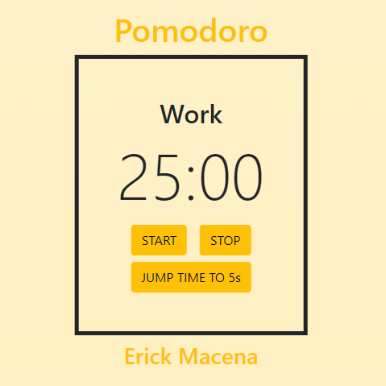

### 🚧🚧 EM CONSTRUÇÃO / BUILDING 🚧🚧

### Pomodoro Clock

The Pomodoro Technique is a time management method developed by Francesco Cirillo in the late 1980s. The technique uses a timer to break down work into intervals, traditionally 25 minutes in length, separated by short breaks - 5 minutes.

#### [Project Origin](https://github.com/florinpop17/app-ideas/blob/master/Projects/1-Beginner/Pomodoro-Clock.md)